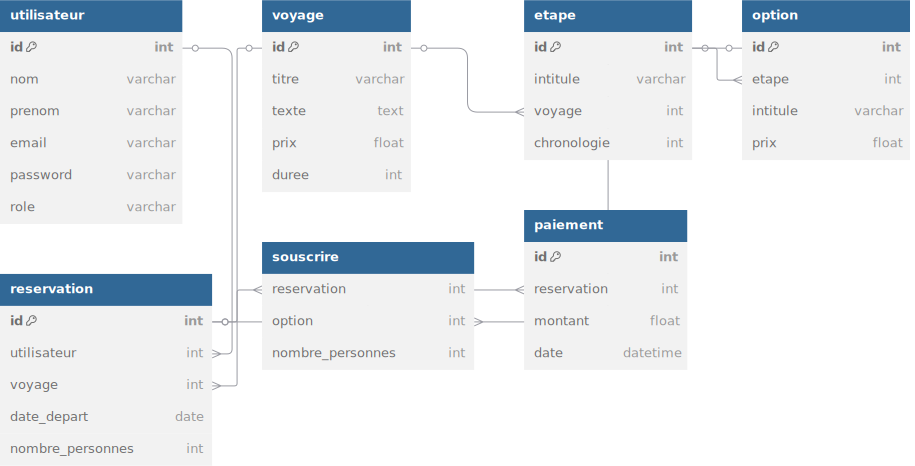

# 🐫 CYvago-MEF2-A

**Projet ClickjourneY 🌍 — Deuxième année de pré-ingénieur CY Tech, Semestre 2 (2024–2025)**

## 🤝 Collaborateurs
- [Mathilde Nelva-Pasqual](https://github.com/mathildenelva)  
- [Jean-Luc Maslanka](https://github.com/JEAN-LUC7)  
- [Gaspard Savès](https://github.com/gaspardsaves)

## 📄 Documentation du projet
- [:scroll: Cahier des charges](Projet_Click_journeY_v1.3_PHASE3-1.pdf)  
- [:credit_card: Interface de paiement CYBank](Projet_Click_journeY_preing2_2024_2025_CYBANK_v1.1-1.pdf)  
- [:ledger: Rapport de projet](rapport-projet-click-journey-mef2-a.pdf)  
- [:pushpin: Charte graphique](charte-graphique-click-journey-mef2-a.pdf)  
- [:memo: Carnet de bord](carnet-de-bord.txt)

## 🐾 Description du projet

**ZanimoTrip** est un site web développé pour une agence de voyage fictive spécialisée dans les séjours centrés sur la découverte de la faune sauvage.

Les utilisateurs peuvent :
- Créer un compte,
- Explorer, rechercher et trier les séjours,
- Gérer leurs informations personnelles,
- Se connecter à une interface administrateur pour la gestion des comptes.

## 💻 Utilisation du site web

1. **Configuration de la base de données** :
   - Importez le fichier [`zanimotrip.sql`](zanimotrip.sql) dans votre système de gestion de base de données pour initialiser la structure et les données.
   
2. **Configuration du site** :
   - Renommez le fichier [`exampleconfig.php`](exampleconfig.php) en `config.php` et adaptez-le à votre environnement local. Ce fichier est inclus automatiquement dans [`database.php`](database.php) qui gère les requêtes SQL.

3. **Comptes de démonstration** :

| Rôle          | Adresse e-mail             | Mot de passe |
|---------------|----------------------------|--------------|
| Admin         | gs@gmail.com               | azerty       |
| Admin         | maslankaje@cytech.fr       | Jas12345     |
| Utilisateur   | AS@gmail.com               | hot          |
| Utilisateur   | DonaldTrump@gmail.com      | qwerty       |
| Utilisateur   | TB@gmail.com               | carrefour    |

---

## 📁 Structure du projet

```bash
CYvago-MEF2-A/
│
├── css/                     # Feuilles de style CSS
│   ├── accueil.css          # Styles de la page d'accueil
│   ├── administrateur.css   # Styles du panneau d'administration
│   ├── def.css              # Définitions des variables CSS (couleurs, polices, transitions)
│   ├── designSite.css       # Styles communs à tout le site (mise en page, header, footer)
│   ├── detail.css           # Styles pour la page détaillée des séjours
│   ├── formulaire.css       # Styles pour les formulaires (connexion, inscription)
│   ├── legal.css            # Styles pour les pages légales
│   ├── mode-clair.css       # Styles pour le thème clair (dark/light mode)
│   ├── monCompte.css        # Styles pour la page de profil utilisateur
│   ├── panier.css           # Styles pour le panier d'achat
│   ├── personnalisation.css # Styles pour la page de personnalisation des voyages
│   ├── presentation.css     # Styles pour la page de présentation de l'agence
│   └── sejours.css          # Styles pour la liste des séjours
│
├── favicon/                 # Fichiers favicon pour navigateurs et systèmes
│
├── img/                     # Images du site (photos, illustrations, logos)
│   ├── footer/              # Images utilisées dans le pied de page
│   ├── trav/                # Images des destinations de voyage
│   └── ...                  # Autres images utilisées sur le site
│   
│
├── js/                      # Fichiers JavaScript
│   ├── admin.js             # Fonctionnalités du panneau administrateur
│   ├── formValidation.js    # Validation des formulaires côté client
│   ├── mode.js              # Gestion du changement de thème clair/sombre
│   ├── moncompte.js         # Fonctionnalités interactives de la page profil
│   ├── tri.js               # Filtrage et tri des séjours sur la page séjours
│   └── updateprice.js       # Mise à jour dynamique des prix selon les options
│
├── phpFrequent/             # Composants PHP réutilisables
│   ├── footer.php           # Pied de page commun à toutes les pages
│   ├── navbar.php           # Barre de navigation principale
│   └── searchbar.php        # Barre de recherche commune à toutes les pages
│
├── exampleconfig.php        # Modèle de configuration pour la base de données
│
├── scheme-database.svg      # Schéma visuel de la base de données
├── zanimotrip.sql           # Script SQL pour initialiser la base de données
│
├── Projet_Click_journeY_v1.3_PHASE3-1.pdf          # Cahier des charges du projet
├── Projet_Click_journeY_preing2_2024_2025_CYBANK_v1.1-1.pdf # Documentation API paiement
├── rapport-projet-click-journey-mef2-a.pdf         # Rapport technique du projet
├── charte-graphique-click-journey-mef2-a.pdf       # Charte graphique du site
├── carnet-de-bord.txt                              # Journal de développement
├── clipZanimoTrip.mp4                              # Vidéo promotionnelle
│
├── accueil.php              # Page d'accueil
├── administrateur.php       # Interface administrateur (gestion des utilisateurs)
├── cgu.php                  # Conditions générales d'utilisation
├── cgv.php                  # Conditions générales de vente
├── confidentialite.php      # Politique de confidentialité
├── connexion.php            # Page de connexion utilisateur
├── database.php             # Centralisation des connexions à la base de données
├── detail.php               # Affichage détaillé d'un séjour avec options
├── getapikey.php            # API pour code de paiement CYBank
├── inscription.php          # Formulaire d'inscription utilisateur
├── logout.php               # Script de déconnexion utilisateur
├── mentions-legales.php     # Mentions légales du site
├── monCompte.php            # Gestion du profil et historique des réservations
├── newaccount.php           # Création d'un nouveau compte après inscription
├── panier.php               # Gestion du panier d'achat
├── parametres.php           # Page de paramètres utilisateur (thème, préférences)
├── personnalisationvoyage.php # Personnalisation des options de voyage
├── presentation.php         # Page de présentation de l'agence ZanimoTrip
├── reservation.php          # Processus de réservation et paiement
├── retourpaiement.php       # Page de retour après paiement (succès/échec)
├── sejours.php              # Catalogue des séjours avec filtres
├── session.php              # Gestion des sessions utilisateur
├── update_profile.php       # Mise à jour des informations de profil
└── verifconnexion.php       # Vérification des identifiants de connexion
```

## Schéma de base de données

